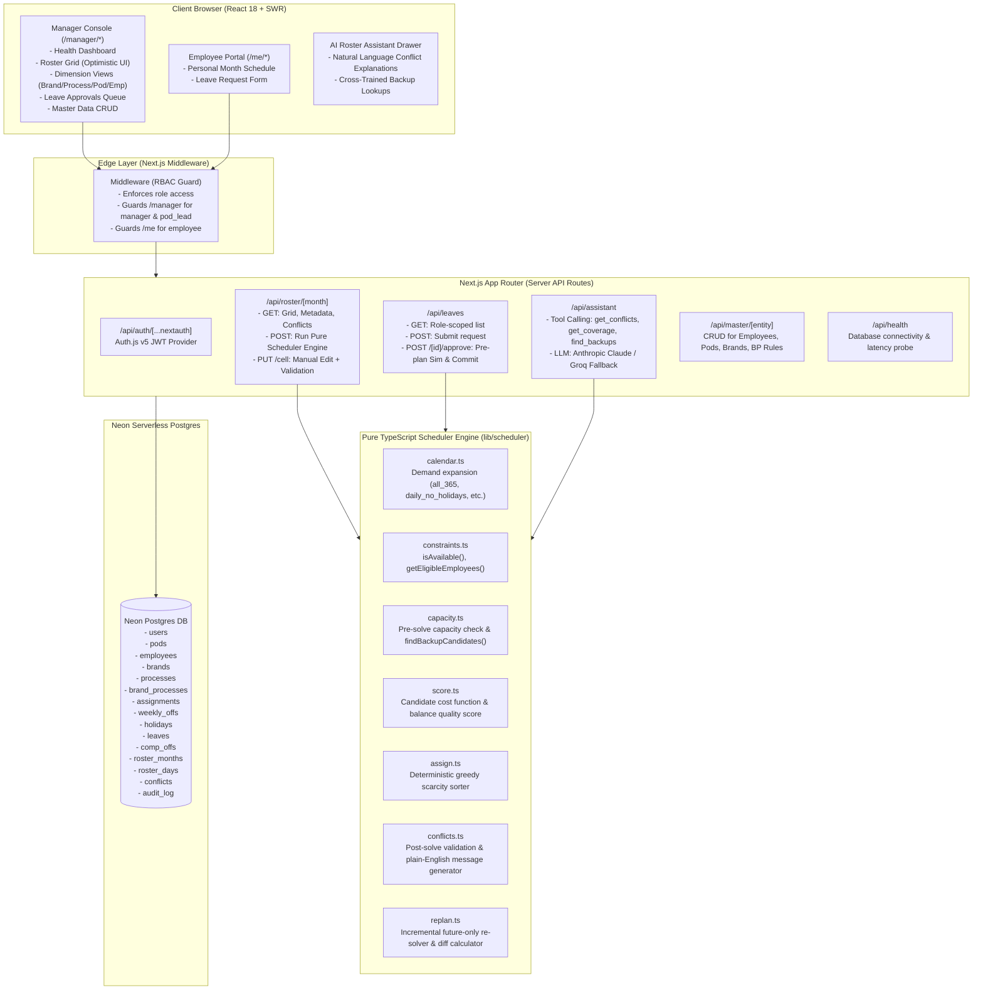
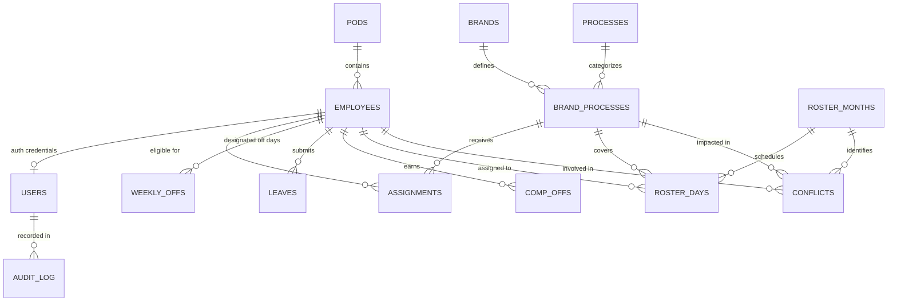

# Architecture & Data Flow

## System Architecture Diagram

```mermaid
flowchart TD
    subgraph Client["Client Browser (React 18 + SWR)"]
        UI_Manager["Manager Console (/manager/*)\n- Health Dashboard\n- Roster Grid (Optimistic UI)\n- Dimension Views (Brand/Process/Pod/Emp)\n- Leave Approvals Queue\n- Master Data CRUD"]
        UI_Employee["Employee Portal (/me/*)\n- Personal Month Schedule\n- Leave Request Form"]
        UI_AI["AI Roster Assistant Drawer\n- Natural Language Conflict Explanations\n- Cross-Trained Backup Lookups"]
    end

    subgraph Edge["Edge Layer (Next.js Middleware)"]
        MW["Middleware (RBAC Guard)\n- Enforces role access\n- Guards /manager for manager & pod_lead\n- Guards /me for employee"]
    end

    subgraph Backend["Next.js App Router (Server API Routes)"]
        API_Auth["/api/auth/[...nextauth]\nAuth.js v5 JWT Provider"]
        API_Roster["/api/roster/[month]\n- GET: Grid, Metadata, Conflicts\n- POST: Run Pure Scheduler Engine\n- PUT /cell: Manual Edit + Validation"]
        API_Leaves["/api/leaves\n- GET: Role-scoped list\n- POST: Submit request\n- POST /[id]/approve: Pre-plan Sim & Commit"]
        API_AI["/api/assistant\n- Tool Calling: get_conflicts, get_coverage, find_backups\n- LLM: Anthropic Claude / Groq Fallback"]
        API_Master["/api/master/[entity]\nCRUD for Employees, Pods, Brands, BP Rules"]
        API_Health["/api/health\nDatabase connectivity & latency probe"]
    end

    subgraph PureEngine["Pure TypeScript Scheduler Engine (lib/scheduler)"]
        Calendar["calendar.ts\nDemand expansion (all_365, daily_no_holidays, etc.)"]
        Constraints["constraints.ts\nisAvailable(), getEligibleEmployees()"]
        Capacity["capacity.ts\nPre-solve capacity check & findBackupCandidates()"]
        Scorer["score.ts\nCandidate cost function & balance quality score"]
        Assign["assign.ts\nDeterministic greedy scarcity sorter"]
        Conflicts["conflicts.ts\nPost-solve validation & plain-English message generator"]
        Replan["replan.ts\nIncremental future-only re-solver & diff calculator"]
    end

    subgraph Database["Neon Serverless Postgres"]
        DB_Tables[("Neon Postgres DB\n- users\n- pods\n- employees\n- brands\n- processes\n- brand_processes\n- assignments\n- weekly_offs\n- holidays\n- leaves\n- comp_offs\n- roster_months\n- roster_days\n- conflicts\n- audit_log")]
    end

    UI_Manager --> MW
    UI_Employee --> MW
    MW --> Backend
    Backend --> DB_Tables
    API_Roster --> PureEngine
    API_Leaves --> PureEngine
    API_AI --> PureEngine
```

## Entity Relationship Diagram

```mermaid
erDiagram
    PODS ||--o{ EMPLOYEES : "contains"
    EMPLOYEES ||--o| USERS : "auth credentials"
    BRANDS ||--o{ BRAND_PROCESSES : "defines"
    PROCESSES ||--o{ BRAND_PROCESSES : "categorizes"
    EMPLOYEES ||--o{ ASSIGNMENTS : "eligible for"
    BRAND_PROCESSES ||--o{ ASSIGNMENTS : "receives"
    EMPLOYEES ||--o{ WEEKLY_OFFS : "designated off days"
    EMPLOYEES ||--o{ LEAVES : "submits"
    EMPLOYEES ||--o{ COMP_OFFS : "earns"
    ROSTER_MONTHS ||--o{ ROSTER_DAYS : "schedules"
    EMPLOYEES ||--o{ ROSTER_DAYS : "assigned to"
    BRAND_PROCESSES ||--o{ ROSTER_DAYS : "covers"
    ROSTER_MONTHS ||--o{ CONFLICTS : "identifies"
    BRAND_PROCESSES ||--o{ CONFLICTS : "impacted in"
    EMPLOYEES ||--o{ CONFLICTS : "involved in"
    USERS ||--o{ AUDIT_LOG : "recorded in"
```
